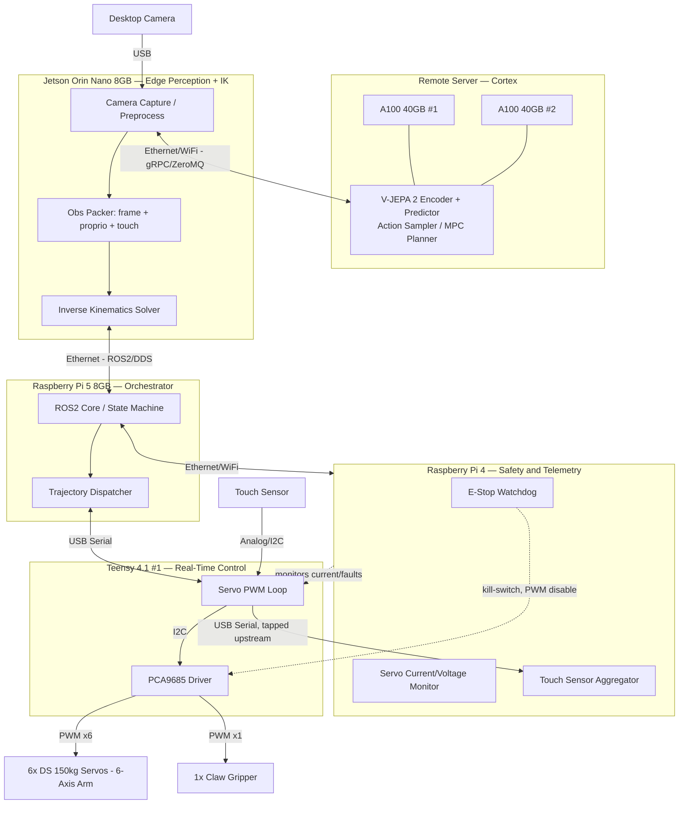

# Hardware Architecture — V-JEPA 2 Robotics Stack

## 1. System Diagram

> You only need 7 servos actively driven (6 for the arm, 1 for the gripper). You can keep the remaining 18 motors as spares, or use them for future expansions! A single Teensy 4.1 and PCA9685 can easily handle the 7 PWM channels.

## 2. Division of Compute

| Tier | Hardware | Responsibility | Rate |
|---|---|---|---|
| **Cortex (slow, deliberate)** | 2x A100 40GB (remote server) | Run V-JEPA 2 encoder + predictor over incoming frames/proprioception; sample/optimize action sequences (CEM/MPC in latent space); optional online fine-tuning of the world model from logged rollouts | ~5–15 Hz (network round-trip bound) |
| **Perception + Kinematics (edge)** | Jetson Orin Nano 8GB | Camera capture and preprocessing (resize/normalize/encode); packing multimodal observation (frame + joint state + touch) sent to the server; receiving target end-effector poses/latent plans back and solving Inverse Kinematics into joint-space waypoints | ~15–30 Hz |
| **Orchestration** | Raspberry Pi 5 8GB | ROS2 core / central state machine; converts IK joint waypoints into timed trajectories; dispatches trajectory segments to both Teensys over USB serial; sequences task phases (approach → grasp → retract) | ~50–100 Hz dispatch |
| **Safety + Telemetry** | Raspberry Pi 4 | Independent watchdog: monitors servo bus current/voltage and Teensy heartbeat; hosts hardware/software E-stop that can cut PWM output regardless of what the Pi 5/Jetson/server are doing; aggregates the touch sensor stream for logging | ~100 Hz polling |
| **Real-Time Control** | 1x Teensy 4.1 | Hard-real-time PWM generation via PCA9685 board for the 7 servos; closed-loop trajectory interpolation (S-curve/trapezoidal) between waypoints from Pi 5; samples the touch sensor directly for lowest-latency reflex response | ~500 Hz–1 kHz control loop |
| **Actuation** | 6x DS 150kg servos, 1x claw gripper | Physical joint motion and grasp closure, driven by PWM from the PCA9685 board | — |

**Design rationale:** the split follows a classic hierarchical control stack — the A100s own the expensive, high-latency "thinking" (world model + planning over the network), the Jetson owns local perception and geometry (things that need the camera and can't tolerate round-trip latency), the Pi 5 owns sequencing/orchestration, and the Teensy owns the hard-real-time servo loop that must never stall waiting on a network call. The Pi 4 is kept off the control critical path specifically so the E-stop/monitoring function survives even if the Jetson, Pi 5, or network link hangs.

## 3. Touch Sensor in the Action-Observation Loop

The touch sensor is wired directly into **Teensy #1** (same board driving the gripper servo) so it participates in the loop at two speeds:

1. **Local reflex (µs–ms, on Teensy):** the Teensy polls the touch sensor at its native ~1 kHz control rate. If contact/force crosses a threshold mid-grasp, the Teensy immediately clamps the gripper's PWM target (stop closing / hold torque) *before* any signal reaches the Pi 5, Jetson, or server. This is the safety/reflex layer — it must not depend on network round-trip.
2. **Upstream observation (10s of ms, through the stack):** the same touch reading is tapped and relayed Teensy → Pi 5 → Jetson, where it's timestamp-aligned with the current camera frame and joint encoder state into a single multimodal observation packet.
3. **World-model conditioning (on the A100s):** V-JEPA 2 ingests touch as an additional observation channel alongside vision/proprioception. Two uses:
   - **Prediction error signal** — compare predicted contact (from the model's rollout) against actual touch reading to detect model/reality mismatch, useful for online calibration or logging failure cases.
   - **Planning objective/constraint** — the CEM/MPC action sampler treats "maintain contact within a force band" (or "achieve contact") as part of the cost function, so the next sampled action (e.g. incremental close, or reposition) is touch-aware.
4. **Loop closure:** the next planned action returns down through Jetson → Pi 5 → Teensy, and the touch sensor's subsequent reading confirms (or refutes) the outcome, becoming the observation for the next planning step — closing the action-observation loop at the slow (server) timescale while the fast reflex loop on the Teensy guarantees the gripper never over-compresses an object while waiting on that round trip.
