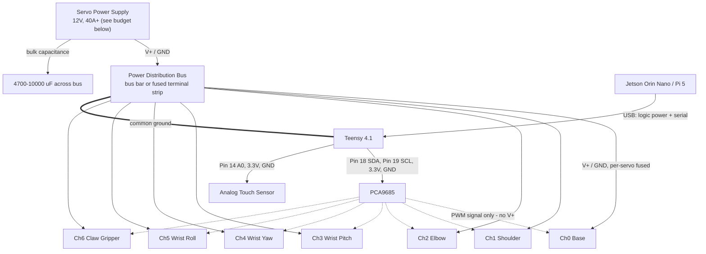

# V-JEPA Robotic Arm — Wiring & Connection Diagram

> **CRITICAL — POWER:** The DS51150 is a **12 V** servo (operating range 10.0–12.6 V) drawing
> **8.0 A stall each**. Seven of them is a **56 A / ~670 W** worst-case bus. Two consequences:
>
> 1. **Servo power must NOT flow through the PCA9685.** Its terminal block and PCB traces are
>    rated for a couple of amps, not 56. Route servo V+ through a separate distribution bus and
>    send only the PWM signal wire from the PCA9685.
> 2. **Never power servos from the Teensy, Pi, or Jetson.** Crossing servo power into logic power
>    will destroy those boards.

## 0. Servo Specification (DS51150)

Verified against the ANNIMOS/DSservo datasheet — check these against your own units before wiring.

| Parameter | Value |
|---|---|
| Operating voltage | 10.0 – 12.6 V |
| Stall torque | 150 kg·cm @10 V · 165 @12 V · 173 @12.6 V |
| Stall current (each) | 8.0 A @12 V |
| Idle current | 5 mA |
| Speed (no load) | 0.21 s/60° @12 V |
| PWM | 500–2500 µs, neutral 1500 µs, 50–330 Hz |
| Travel | **180±3° or 270±3° — two variants exist** |
| Ingress rating | IP66 |

> **Confirm which travel variant you have before driving the arm.** The firmware's `angleToPulse()`
> maps 0–180° onto the 500–2500 µs span. On a 270° unit that same span covers 270°, so a commanded
> `90` lands the joint at **135° actual** — every angle off by 1.5×.

## 1. High-Level Wiring Flow

Note that servo power and servo signal take **separate paths**. This is the important correction
versus a naive single-path wiring.

## 2. Power Budget

| Case | Current @12 V | Notes |
|---|---|---|
| All 7 stalled | 56 A | Absolute worst case; should never occur in normal operation |
| Realistic peak | 25–35 A | Several joints accelerating under load simultaneously |
| Holding a pose | 5–15 A | Depends heavily on arm extension and payload |
| Idle | ~35 mA | 7 × 5 mA |

**Recommended supply: 12 V at 40 A minimum (480 W).** That covers realistic peaks with headroom
while not sizing for a simultaneous seven-way stall, which the firmware's slew limiting and the
mechanical design should prevent anyway. If you want full stall margin, 60 A.

Add **4700–10000 µF of bulk capacitance** across the bus near the servos. Servo inrush causes
voltage sag that browns out logic if the rails share a source; the capacitance absorbs it.

Fuse each servo branch individually (10 A) so a single stalled joint cannot pull the whole bus down.

## 3. Pin-by-Pin Connection Guide

### A. Teensy 4.1 ↔ PCA9685 (I2C, logic only)
*   **Teensy Pin 18 (SDA0)** ➡️ **PCA9685 SDA**
*   **Teensy Pin 19 (SCL0)** ➡️ **PCA9685 SCL**
*   **Teensy 3.3V** ➡️ **PCA9685 VCC** *(chip logic only — never servo power)*
*   **Teensy GND** ➡️ **PCA9685 GND**

### B. PCA9685 V+ terminal block — LEAVE DISCONNECTED

Do **not** feed 12 V into the PCA9685's V+ terminal block. Two reasons: the board's traces cannot
carry the servo bus current, and many PCA9685 breakouts fit a V+ electrolytic rated only 6.3–10 V,
which 12 V would exceed outright. Check your board's capacitor rating if you are tempted.

The PCA9685 contributes **only the signal wire** to each servo.

### C. Power Distribution Bus ↔ Servos
*   **PSU V+ (red)** ➡️ **bus bar / fused terminal strip** ➡️ each servo's **red** wire
*   **PSU GND (black)** ➡️ **bus ground** ➡️ each servo's **brown/black** wire
*   Use wire gauge appropriate to the branch current — **16 AWG minimum per servo**, and size the
    main PSU-to-bus run for the full bus current (**10 AWG or heavier**).

### D. PCA9685 ↔ Servos (signal only)
Run only the **orange/yellow signal** wire from each PCA9685 channel header to its servo.

*   Channel 0: Base
*   Channel 1: Shoulder
*   Channel 2: Elbow
*   Channel 3: Wrist Pitch
*   Channel 4: Wrist Yaw
*   Channel 5: Wrist Roll
*   Channel 6: Claw Gripper

### E. Common Ground — REQUIRED

The servo power ground and the Teensy/PCA9685 logic ground **must be tied together**, or the PWM
signal has no reference and the servos will behave erratically or not at all. Tie them at the
distribution bus, at a single point, to avoid ground loops.

### F. Teensy 4.1 ↔ Analog Touch Sensor
*   **Touch Sensor VCC** ➡️ **Teensy 3.3V**
*   **Touch Sensor GND** ➡️ **Teensy GND**
*   **Touch Sensor OUT** ➡️ **Teensy Pin 14 (A0)**

### G. Jetson Orin Nano / Raspberry Pi 5 ↔ Teensy 4.1
*   Standard **Micro-USB to USB-A/USB-C** cable, providing 5 V logic power and the serial link
    carrying trajectory commands.

## 4. Bring-Up Order

The firmware boots with all servos **limp** (no PWM pulse) and refuses motion commands until it
receives an explicit `HOME`. This is deliberate: the arm's resting position at power-up is unknown,
and driving any angle immediately would yank every joint there at full 165 kg·cm torque.

1. Wire everything with the **servo PSU off**.
2. Verify continuity and, critically, that **no 12 V path reaches the PCA9685, Teensy, or Pi**.
3. Power logic only. Confirm `READY` on the serial monitor.
4. Power the servo bus. The arm should stay limp.
5. **Position the arm near neutral by hand** — servos back-drive freely with no pulse.
6. Send `HOME`. Joints energize at 90° and hold.
7. Test one joint at a time with small deltas before commanding full trajectories.

`RELAX` returns all servos to limp at any time.
