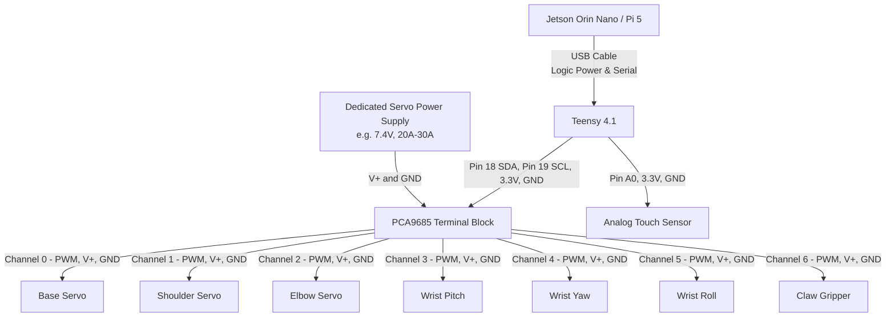

# V-JEPA Robotic Arm — Wiring & Connection Diagram

> **CRITICAL WARNING:** Your 150kg DSservos draw a MASSIVE amount of current (often 3-5 Amps *each* at stall). **NEVER** power the servos directly from the Teensy, Raspberry Pi, or Jetson. You must use a dedicated, high-current external power supply (e.g., a 7.4V or 8.4V DC supply rated for at least 20+ Amps) connected to the PCA9685 terminal block. If you cross servo power with logic power, you will instantly fry your boards!

## 1. High-Level Wiring Flow

---

## 2. Pin-by-Pin Connection Guide

### A. Teensy 4.1 ↔ PCA9685 (I2C Communication)
This connects the "brain" of the arm to the PWM driver board.
*   **Teensy Pin 18 (SDA0)** ➡️ **PCA9685 SDA**
*   **Teensy Pin 19 (SCL0)** ➡️ **PCA9685 SCL**
*   **Teensy 3.3V** ➡️ **PCA9685 VCC** *(Note: This powers the chip logic, NOT the servos)*
*   **Teensy GND** ➡️ **PCA9685 GND**

### B. PCA9685 ↔ External Power Supply (Servo Power)
This provides the heavy lifting juice for the 150kg motors.
*   **Power Supply V+ (Positive, Red)** ➡️ **PCA9685 V+ Terminal Block** (Green block at the top)
*   **Power Supply GND (Negative, Black)** ➡️ **PCA9685 GND Terminal Block**
*   *Make sure your power supply voltage matches your specific servo ratings (usually 6.0V - 8.4V).*

### C. PCA9685 ↔ 7x DSservos
Plug the servos directly into the 3-pin headers on the PCA9685. Pay close attention to the wire colors:
*   **Brown / Black wire** ➡️ Bottom row (GND)
*   **Red wire** ➡️ Middle row (V+)
*   **Orange / Yellow wire** ➡️ Top row (PWM)
*   *Mapping:*
    *   Channel 0: Base
    *   Channel 1: Shoulder
    *   Channel 2: Elbow
    *   Channel 3: Wrist Pitch
    *   Channel 4: Wrist Yaw
    *   Channel 5: Wrist Roll
    *   Channel 6: Claw Gripper

### D. Teensy 4.1 ↔ Analog Touch Sensor
This gives the gripper a physical sense of touch.
*   **Touch Sensor VCC** ➡️ **Teensy 3.3V**
*   **Touch Sensor GND** ➡️ **Teensy GND**
*   **Touch Sensor OUT (Signal)** ➡️ **Teensy Pin 14 (A0)**

### E. Jetson Orin Nano / Raspberry Pi 5 ↔ Teensy 4.1
*   Use a standard **Micro-USB to USB-A (or USB-C) cable**. 
*   Plug the Micro-USB end into the Teensy and the standard USB end into the Jetson/Pi.
*   This cable provides both the 5V logic power to run the Teensy *and* the serial data connection to send the trajectory commands from the V-JEPA model!
